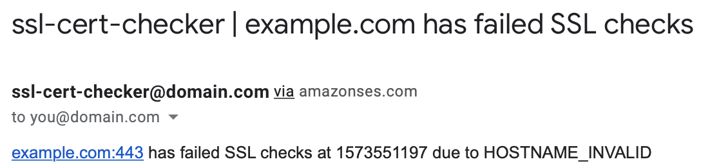

# ssl-cert-checker

By Corey Gale (`mechtrondev[at]gmail.com`)

## Executive summary

Provisions a Lambda function that checks a configurable list of hostnames for SSL connectivity issues. Notifies you via email when checks fail. Includes a CLI tool for easy management of hostnames to monitor.

## Features

1. Checks for a variety of SSL failure modes including cert expiry, invalid hostnames and broken cert chains
1. Email notifications for check failures
1. List of hostnames to check stored in DynamoDB
1. (optional) Audit trail of failed checks persisted to DynamoDB
1. CLI tool for managing the inventory of hostnames to monitor
1. Terraformed IaC (deploy to your AWS account in a single command)
1. Operates within AWS's free tier

#### Example notification



## CLI tool usage

Managing the list of hostnames to continually check for SSL issues is easy using. Simply use the included CLI tool:

#### Setup the CLI tool

1. Make sure Python 3 & Pip 3 are installed
1. Install pip dependencies: `pip3 install -r checker/requirements.txt --user`
1. Create a symlink to invoke the CLI tool: `ln -s $(pwd)/manage.py /usr/local/bin/ssl-cert-checker`

### Create a new check

To create a new SSL check, use the `create` action:

	ssl-cert-checker --action create --hostname example.com --notification-target admin@example.com

Here's a full list of supported parameters:

| Parameter     | Description   | Type | Default |
| :------------ |:--------------|:----:|:-------:|
| `hostname` | The hostname of the target service | required | |
| `port` | The port of the target service | optional | `443` |
| `check-interval-minutes` | How often (in minutes) to check the target hostname | required | `15` |
| `notification-target` | The target address to send failure notifications to | optional | |
| `notification-minutes-before-resending` | How long (in minutes) before re-sending failure notifications | optional | `30` |
| `cert-expiry-notify-before-days` | Notify me this many days before my certificate expires | optional | `30` |
| `failed-check-history-days` | How long (in days) to retain records of failed checks in DynamoDB (enter `0` for unlimited storage) | optional | `0` |

Example output:
	
	New on-going SSL check for example.com successfully created

### List all checks

You can list all hostnames to check for SSL issues using the `list` action:

	ssl-cert-checker --action list

Example output:

```
Retrieving list of ongoing SSL checks from DynamoDB..
2 SSL check(s) successfully loaded
+----------+-------------+------+----------------------+--------------------+-----------------------+------------------------------------+----------------------------+---------------------+---------------------+-------------------------+---------------------------+---------------------+
|    Id    |   Hostname  | Port | CheckIntervalMinutes | NotificationTarget | SubscriptionEmailSent | NotificationMinutesBeforeResending | CertExpiryNotifyBeforeDays |     LastChecked     |     LastFailure     | LastFailureNotification | FailedChecksRetentionDays |       Created       |
+----------+-------------+------+----------------------+--------------------+-----------------------+------------------------------------+----------------------------+---------------------+---------------------+-------------------------+---------------------------+---------------------+
| 45068762 | example.com | 443  |          15          | admin@example.com  |         True          |                 30                 |             30             | 2019-11-13 00:46:23 | 2019-11-13 00:46:23 |   2019-11-13 00:18:12   |            120            | 2019-11-12 01:29:03 |
| cfde538c |  example.ca | 443  |          15          | admin@example.com  |         True          |                 30                 |             30             | 2019-11-13 00:46:24 | 2019-11-13 00:46:24 |   2019-11-13 00:18:15   |            120            | 2019-11-12 01:29:06 |
+----------+-------------+------+----------------------+--------------------+-----------------------+------------------------------------+----------------------------+---------------------+---------------------+-------------------------+---------------------------+---------------------+
```

### List all check failures

You can list all failures for all hostnames using the `list-failures` action:

	ssl-cert-checker --action list-failures

Example output:

```
Retrieving list of failed SSL checks from DynamoDB..
5 failed checks loaded
+----------+----------+---------------------+-------------------------+---------------------+
|    Id    | CheckId  |   FailureTimestamp  |       FailureMode       |      CertExpiry     |
+----------+----------+---------------------+-------------------------+---------------------+
| 4d35475d | 45068762 | 2019-11-13 00:46:23 | SSL_CERTIFICATE_EXPIRED | 1969-12-31 15:59:59 |
| 9b7b1b7a | cfde538c | 2019-11-13 00:46:24 |     INVALID_HOSTNAME    | 1969-12-31 15:59:59 |
+----------+----------+---------------------+-------------------------+---------------------+
```

#### List check failures for a certain domain

_COMING SOON_

You can list all failures for a certain hostname by adding the optional `--domain` switch:

	ssl-cert-checker --action list-failures --domain example.com

### Delete a check

You can also delete users using the `delete` action:

	ssl-cert-checker --action delete --id 4d35475d

Where `--id` is the check id which can be obtained using the `list` action.

Example output:

	SSL check with ID 4d35475d was successfully deleted

## Detected failure modes

When an SSL connectivity test fails, you will get an email alert with a failure modes recorded:

| `curl` exit code | Failure mode | Description |
|:---------------: | :----------: |:------------|
| `6` | `HOSTNAME_INVALID` | Couldn't resolve host. The given remote host's address was not resolved. The address of the given server could not be resolved. |
| `7` | `FAILED_TO_CONNECT` | Failed to connect to host. curl managed to get an IP address to the machine and it tried to setup a TCP connection to the host but failed. |
| `16` | `HTTP2_ERROR` | HTTP/2 error. A problem was detected in the HTTP2 framing layer. This is somewhat generic and can be one out of several problems, see the error message for details. |
 | `22` | `400_LEVEL_STATUS_CODE` | HTTP page not retrieved. The requested url was not found or returned another error with the HTTP error code being 400 or above. |
| `27` | `CURL_OUT_OF_MEMORY` | Out of memory. A memory allocation request failed. curl needed to allocate more memory than what the system was willing to give it and had to exit. |
| `28` | `CONNECTION_TIMED_OUT`| Operation timeout. The specified time-out period was reached according to the conditions. curl offers several timeouts, and this exit code tells one of those timeout limits were reached. |
| `33` | `HTTP_RANGE_ERROR` | HTTP range error. The range request did not work. Resumed HTTP requests are not necessary acknowledged or supported. |
| `35`  | `SSL_HANDSHAKE_FAILED` | A TLS/SSL connect error. The SSL handshake failed. |
| `47` | `TOO_MANY_REDIRECTS` | Too many redirects. When following HTTP redirects, libcurl hit the maximum number set by the application. The maximum number of redirects is unlimited by libcurl but is set to 50 by default. |
| `51` | `SSL_CERTIFICATE_SIGNATURE_INVALID` | The server's SSL/TLS certificate or SSH fingerprint failed verification. curl can then not be sure of the server being who it claims to be. |
| `52` | `SSL_EMPTY_RESPONSE` | The server did not reply anything, which in this context is considered an error |
| `55` | `CURL_NETWORK_FAILED_SEND` | Failed sending network data |
| `56` | `CURL_NETWORK_FAILED_RECEIVE` | Failure in receiving network data |
| `58` | `CURL_SSL_LOCAL_CERTIFICATE_ERROR` | Problem with the local certificate. The client certificate had a problem so it could not be used. |
| `60` | `SSL_CERTIFICATE_EXPIRED` | Peer certificate cannot be authenticated with known CA certificates |
| `77` | `CURL_SSL_CA_CERTIFICATE_READ_ERROR` | Problem with reading the SSL CA cert |
| `80` | `CURL_SSL_CONNECTION_CLOSURE_FAILED` | Failed to shut down the SSL connection |
| `83` | `SSL_CERTIFICATE_ISSUER_CHECK_FAILED` | TLS certificate issuer check failed |
| `90` | `SSL_PUBLIC_KEY_DOES_NOT_MATCH_PINNED_KEY` | SSL public key does not matched pinned public key |
| `91` | `SSL_CERTIFICATE_STATUS_INVALID` | Invalid SSL certificate status |

Note: if `ssl-cert-checker` sees an unexpected `curl` exit code, a failure mode of `CURL_UNKNOWN_EXIT_CODE_<curl_exit_code>` will be used.

## AWS infrastructure

#### Resources

- Lambda function triggered by CloudWatch Events (fire every 5 minutes)
- DynamoDB table for hostname list and peristing failed checks
- CloudWatch Log Stream for Lambda function output
- SES for email notifications

#### Estimated cost

All of the AWS resources provisioned by this project fit within [AWS's always-free tier](https://aws.amazon.com/free/?all-free-tier.sort-by=item.additionalFields.SortRank&all-free-tier.sort-order=asc&awsf.Free%20Tier%20Types=tier%23always-free), with a single exception that is SMS messages. Within the free tier, AWS includes 1000 notifications per month, which, depending on the reliability of your infrastructure, should be more than enough for all your failure notifications.

Just to be safe, to avoid bill shock I suggest that you set up a [billing alarm](https://docs.aws.amazon.com/AmazonCloudWatch/latest/monitoring/monitor_estimated_charges_with_cloudwatch.html) for your AWS account.

## Deploying `ssl-cert-manager` to your AWS account

#### Dependencies

1. `make`
1. Terraform v0.12.x
1. Terragrunt v0.20.x

#### Deploy an environment

1. Update the Terragrunt values in `terraform/terragrunt/terragrunt.hcl` to match your AWS account's configuration.
1. To deploy the `prod` environment (using the Terragrunt variables stored in `terraform/terragrunt/prod/terragrunt.hcl`):

		ENV=prod TF_ACTION=apply make terragrunt

#### Destroy an environment

To destroy an environment (in this case `prod`), set the `TF_ACTION` environment variable to `destroy`:

	ENV=prod TF_ACTION=destroy make terragrunt

#### Creating new environments

Creating new environments is as easy as creating a new Terragrunt environment folder:

1. Copy `terraform/terragrunt/prod/terragrunt.hcl` to a new sub-directory under `terraform/terragrunt/`. The name that you choose for this directory will be your new environment's name.
1. Update the environment's name in the newly copied `terragrunt.hcl` file under the `inputs` section near the end of the file.
1. Deploy your environment with `make`:
		
		ENV=<ENV> TF_ACTION=apply make terragrunt
		
	Where `<ENV>` is your new environment's name.

## To do

1. Add TTL to DynamoDB items in failed checks history table
1. Send `SSL_CERTIFICATE_EXPIRED` alerts before cert actually expires
1. Add `--domain` switch to return failures for a certain hostname only. Example: `ssl-cert-checker --action list-failures --domain example.com`
1. Add support for "Fixed: back online" notifications
1. Add support for Slack notifications
1. Add GitHub Actions deployment pipeline
